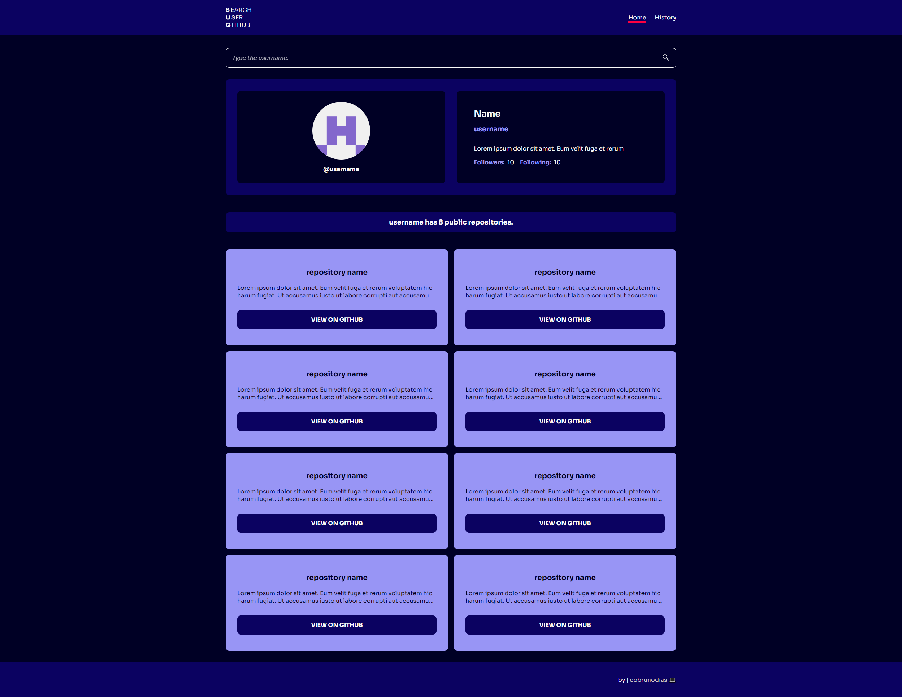

# 🔍 GitHub User Search

🇧🇷 [Portuguese](README_pt-br.md)

## 📜 About the Project

Search for GitHub users by username and view detailed information about their profile. It features a minimalist and intuitive interface, and includes a search history that can be saved for future reference.

## 💻 Pages

### Home

The main page where you can search for GitHub users by entering their username. The results display the user's profile information, including their avatar, bio, and public repositories.



### History

The history page displays a list of previous user searches, allowing you to revisit profiles you've searched for before.


## ✔ Features

- 🔍 **User Search**: Enter a GitHub username to fetch and display the user's profile information.
- 🗂 **Search History**: Keep track of previously searched usernames, with plans to save this history locally.
- 🌐 **API Integration**: Fetch data directly from the GitHub API for real-time results.
- 💾 **Local Storage**: Save search history even after refreshing or closing the browser.

## 🛠 Technologies Used

  

## 🤝 Contributing

_Where can I improve?_

We welcome contributions! Whether it's improvements, bug fixes, or new features, feel free to contribute:

1. Fork the repository.
2. Create a new branch (`git checkout -b feature/new-feature`).
3. Make your changes and commit them (`git commit -am 'Add new feature'`).
4. Push your changes (`git push origin feature/new-feature`).
5. Open a Pull Request on GitHub.

## Project Setup

### Install dependencies

```sh
npm install
```

### Compile and Hot-Reload for Development

```sh
npm run dev
```

### Type-Check, compile and minify for Production

```sh
npm run build
```

### Lint with [ESLint](https://eslint.org/)

```sh
npm run lint
```

---

## License

This project is licensed under the MIT License. See the [LICENSE](LICENSE) file for more details.

---
