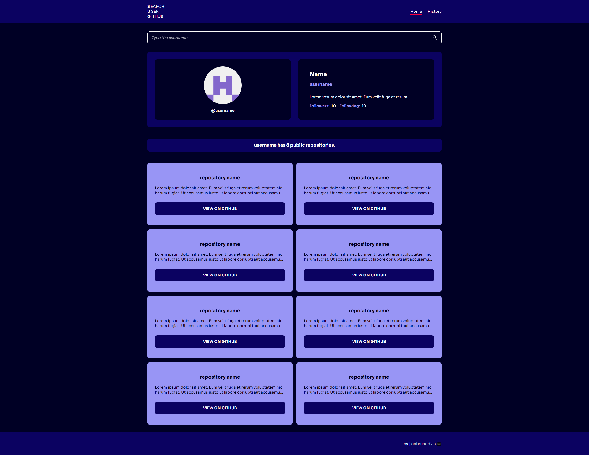

# 🔍 GitHub User Search

## 📜 Sobre o projeto

Pesquise usuários do GitHub pelo nome de usuário e visualize informações detalhadas sobre o perfil deles. Ele apresenta uma interface minimalista e intuitiva, e inclui um histórico de pesquisa que pode ser salvo para referência futura.

## 💻 Páginas

### Início

A página principal onde você pode pesquisar usuários do GitHub inserindo o nome de usuário. Os resultados exibem as informações do perfil do usuário, incluindo seu avatar, biografia e repositórios públicos.



### Histórico

A página de histórico exibe uma lista de pesquisas anteriores de usuários, permitindo que você revisite os perfis que pesquisou antes.


## ✔ Features

- 🔍 **Pesquisa de usuário**: Insira um nome de usuário do GitHub para buscar e exibir as informações do perfil do usuário;
- 🗂 **Histórico de pesquisa**: Acompanhe os nomes de usuário pesquisados ​​anteriormente, com planos para salvar esse histórico localmente;
- 🌐 **Integração de API**: Busque dados diretamente da API do GitHub para obter resultados em tempo real;
- 💾 **Local Storage**: Salve o histórico de pesquisa mesmo após atualizar ou fechar o navegador.

### New Features

- 🗑️ **Remover Usuário do Histórico**: Permite remover um usuário do histórico com um único clique.
- 📅 **Data de Pesquisa**: Registra a data e hora em que você pesquisou um usuário.

## 🛠 Tecnologias usadas

  

_Onde posso melhorar?_

Contribuições são bem-vindas! Sejam melhorias, correções de bugs ou novos recursos, sinta-se à vontade para contribuir.

## Configuração do projeto

### Instalar as dependências

```sh
npm install
```

### Compilar e recarregar para desenvolvimento

```sh
npm run dev
```

### Verificação de tipo, compilar e minificar para produção

```sh
npm run build
```

### Lint with [ESLint](https://eslint.org/)

```sh
npm run lint
```

---

## License

This project is licensed under the MIT License. See the [LICENSE](LICENSE) file for more details.

---
